## Introduction
With the increasing popularity of hand held devices with the capacity to record audio and video there is a whole amount of audio and video data available that has immense potential for use in research and real world applications. Crowd sourcing is the concept of presenting a problem to a a large group of people and trying to utilize the best combination of the solutions received from this large group \cite{howe2006rise}. Crowd sourcing has been used before for creative design and creating online databases \cite{Brabham2011}.

Crowd sourcing has seen applications in audio where audience contributed recorings were used for reconstructing concerts  \cite{Shrstha:2007:SMV:1291233.1291367}, \cite{kennedy2009less}. However, crowd sourcing for recreating live events needs a way to ensure common audio quality throughout the constructed recording because sudden changes in the bandwidth, distortion etc. while listening to an audio file are undesirable. This is where common audio extraction is important. The main challenge of common audio extraction is that it needs to ensure that the audio extracted is of better or comparable quality to the best recording available in the mixture.

The problem that this paper addresses is generating a good quality recording of a concert after crowd sourcing various audience recordings of that particular concert, here the measurement of how 'good' a recording is done using the signal to distortion ratio (SDR). The most obvious solution to this problem is to identify the best recording from the recordings provided by the users. The main drawback with this solution is it assumes that there is at least one good quality recording, if all the recordings are of inferior quality this approach is not very useful. The aim of the algorithm introduced in this paper is to generate a recording that is of decent quality even if the audience contributed recordings are of poor quality.

To solve the problem described a modified version of non-negative matrix factorization (NMF) is used to separate the noise from the music. The paper is structured as follows: Section 2 describes the related work in this area. Section 3 describes the algorithm used in this research. Section 4 describes the evaluation procedure and the results. Finally, section 5 draws conclusions from the results and provides suggestions for future work.
”.

<figure>
	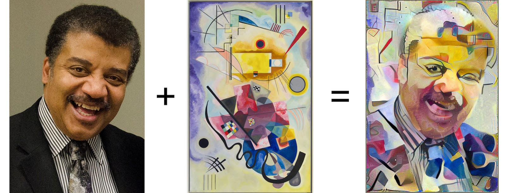
	<figcaption>Left: Content Image, Middle: Style Image, Right: Content + Style, image source: <a href="https://research.googleblog.com/2016/02/exploring-intersection-of-art-and.html" target="_blank">Google Research Blog</a></figcaption>
</figure>

This not only sparked interest among numerous other researchers (e.g., [1](https://link.springer.com/chapter/10.1007/978-3-319-46475-6_43) and [2](https://arxiv.org/pdf/1609.03057.pdf)), but also spawned several successful mobile applications like [Prisma](https://prisma-ai.com/){:target="_blank"}. Over the last couple of years. these image style transfer methods have undergone significant improvements leading to some impressive results.

<figure>
	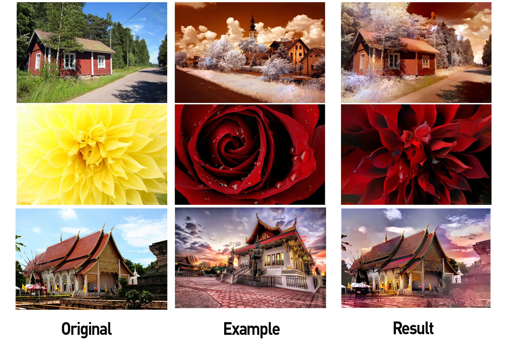
	<figcaption>Style Transfer by Adobe, image source: <a href="https://www.engadget.com/2017/03/30/adobes-experimental-app-copies-one-photos-style-to-another/" target="_blank">Engadget</a></figcaption>
</figure>

<figure>
	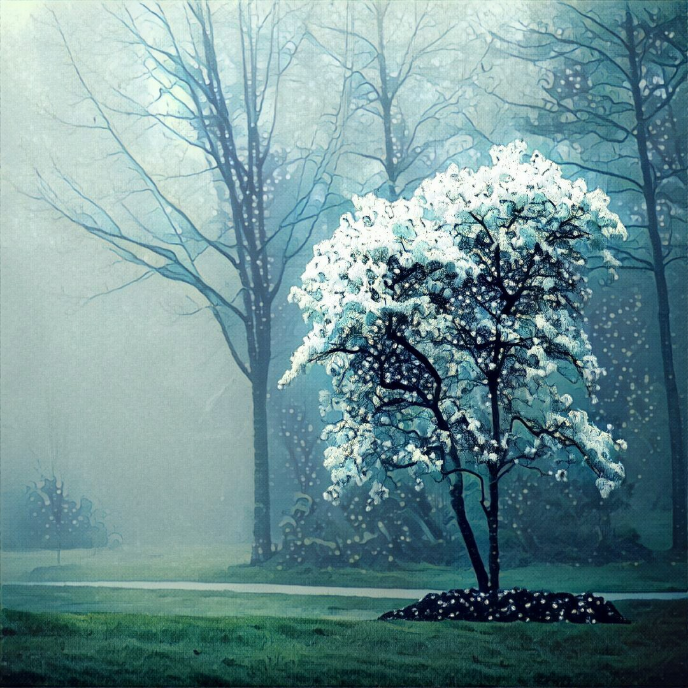
	<figcaption>Example from <a href="https://prisma-ai.com/p/fac6d4e6-2064-4264-a539-cc2d3e6c30b8" target="_blank">Prisma website</a></figcaption>
</figure>

For a short intro to how these algorithms work, check out the video below.

<iframe width="560" height="315" src="https://www.youtube.com/embed/WHmp26bh0tI" frameborder="0" gesture="media" allow="encrypted-media"> </iframe>

However, in spite of the success with images, the application of these techniques to other domains such as audio or music has been rather limited (see [3](https://audiostyletransfer.wordpress.com/){:target="_blank"} and [4](https://dmitryulyanov.github.io/audio-texture-synthesis-and-style-transfer/){:target="_blank"}) and the results are far less convincing than those achieved using images. This suggests that this is a harder problem. In this study, we want to explore musical style transfer in more detail and arrive at some possible approaches to tackle this problem. 

## Why is Style Transfer for Music Hard?
Before digging into why style transfer for music is hard, we need to first ask **what is Style Transfer in music**? The answer to this is not trivial. For images, the concepts of content and style are intuitive. While image content is described by the objects present in the image, e.g., dogs, houses, faces, etc., image style is understood as colors, lighting, brush-strokes and texture of the image. 

However, music is **semantically abstract** and **multi-dimensional** in nature. Musical content can mean different things in different contexts. Often, one would associate musical content with the melody and musical style with the orchestration or harmonization. However, content could also refer to lyrical content and the different melodies used to sing those lyrics could be interpreted as different styles. In a classical music setting, musical content could be defined as the written score (which includes harmonization as well), whereas style can be the interpretation of the score by the performer wherein the performer adds his/her own musical expression (by deviating from and adding to the score). To get a better idea of what Style Transfer in music could be, check out these two interesting videos below. 

<iframe width="560" height="315" src="https://www.youtube.com/embed/S75gYhODS0M?rel=0" frameborder="0" gesture="media" allow="encrypted-media"></iframe>
<iframe width="560" height="315" src="https://www.youtube.com/embed/buXqNqBFd6E?rel=0" frameborder="0" gesture="media" allow="encrypted-media"></iframe>

The latter actually uses several machine learning [techniques](https://youtu.be/0qnTaAz-xtQ) to achieve the results.

Thus, style transfer for music is, by definition, not easily defined. There are other key factors which make this even more challenging:
1. Music is **NOT well-understood by machines** (yet !!): The success of style transfer for images actually stems from the success of DNNs at image understanding tasks such as object detection. Since DNNs are able to learn features which can discriminate between different objects in images, back-propagation techniques can be leveraged to morph a target image to match the features of the content image. While we have made significant [progress](https://github.com/ybayle/awesome-deep-learning-music/blob/master/fig/articles_per_year.png){:target="_blank"} in the development of DNN based models for music understanding tasks (e.g., melody transcription, genre detection, etc.), we are still far from the results achieved in the image domain. This is a serious limitation for style transfer in music. The models we have now simply don’t learn “excellent” features capable of categorizing music and hence, direct application of the style transfer algorithms used in the image domain do not give similar results. 
2.	Music is **Temporal**: Music is a time-series data i.e. a piece of music evolves over time. This makes learning difficult. Even though Recurrent Neural Networks (RNNs) and [LSTMs](http://colah.github.io/posts/2015-08-Understanding-LSTMs/){:target="_blank"} (Long Short-Term Memory) have enabled learning temporal data more efficiently, we have yet to develop robust models able to learn to reproduce the long-term structure which is observed in music (side-note: this is an active area of research and researchers at the Google’s Magenta team have had moderate success at [this](https://magenta.tensorflow.org/2016/07/15/lookback-rnn-attention-rnn){:target="_blank"}).
3. Music is **Discrete** (at a symbolic level at least !!): Symbolic music or written music is discrete in nature. In the [Equal Temperament](https://en.wikipedia.org/wiki/Equal_temperament){:target="_blank"} system which is the most popular tuning system used currently, musical pitches are constrained to occupy discrete positions on the continuous frequency scale. Similarly, note durations also lie in a discrete space (usually quantized to quarter-notes, whole-notes, etc.). This makes it rather hard to adapt pixel-wise back-propagation methods (used for images) to the symbolic music domain. 

<figure>
	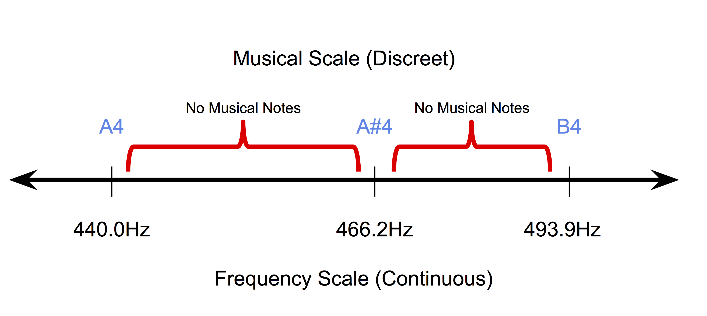
	<figcaption>Discrete nature of musical pitches in equal temperament system</figcaption>
</figure>

Hence, techniques used in image style transfer don’t logically extend to music directly. For style transfer algorithms to work for music, they need to be re-designed with a strong emphasis on musical concepts and ideas. 

## Why do we need Style Transfer for Music?
Before delving into how we can tackle this problem, it is also important to understand why is this a problem worth solving. As with images, potential applications for musical style transfer are quite interesting. A direct application of such a technique would be to **develop tools to help composers**. For e.g. an automatic tool which can transform a melody using orchestrations from different genres would be extremely useful for a composer allowing him/her to try different ideas quickly. Such tools might also find traction amongst DJs looking to mash-up songs with different styles. 

An indirect though rather significant outcome of improvements in musical style transfer would be improvements in music informatics systems. As explained in the previous section, for style transfer to work for music data, the models that we develop need to be able to **"understand"** different aspects of music better. 

## Simplifying the Style Transfer problem for Music
Looking at the nature and complexity of the task at hand, we start with a very simple case of analyzing monophonic melodies for different genres of music. Monophonic melodies are sequences of notes where each note is described by its Pitch and Duration. While the Pitch progression mostly adheres to the scale of the melody, the Duration progression is dependent on the Rhythm. As a starting point, we can thus make a clear distinction between **Pitch Content** and **Rhythmic Style** as two entities using which we can rephrase the Style Transfer problem. By working with monophonic melodies for now, we also avoid having to deal with problems such as orchestration and lyrics.

In the absence of pre-trained models capable of successfully learning features to distinguish between pitch progressions and rhythms of monophonic melodies, we first introduce an extremely simple approach to style transfer for music. Instead of trying to morph pitch content learned from a target melody with the rhythmic style learned from a target rhythm, we try to learn pitch and duration patterns of different genres separately and then attempt to fuse them together later. An overview of the approach is shown below. 

<figure>
	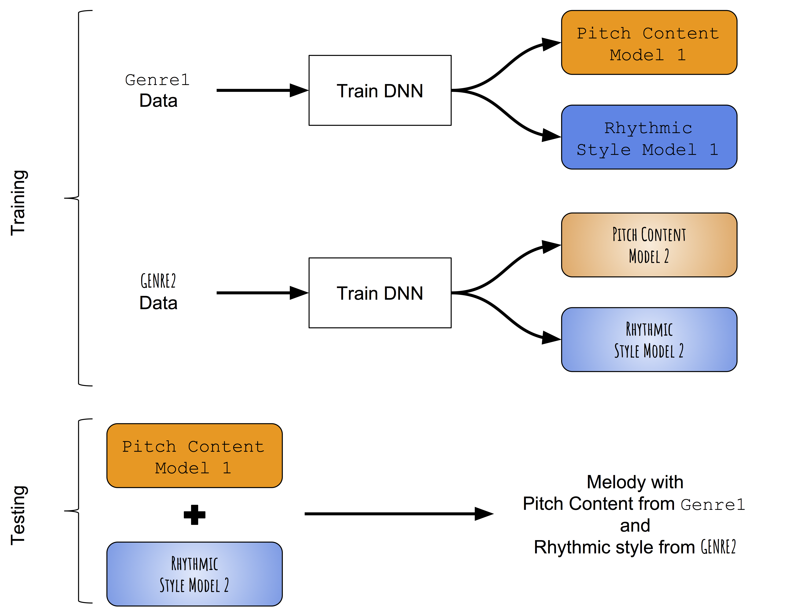
	<figcaption>Overview of the Genre Style Transfer method</figcaption>
</figure>

## Learning pitch and rhythm progressions separately

_Data Representation:_

We represent monophonic melodies as sequence of musical notes wherein each musical note has a pitch and a duration index. To make the representation key independent we use an interval based representation, where the pitch of the next note is represented as a deviation (+/- $$x$$ semitones) from the pitch of the previous note. For both pitch and duration, we create 2 dictionaries in which each discrete state (+1, -1, +2, -2 etc. for pitch and quarter-note, whole-note, dotted-quarter note, etc., for durations) is assigned a dictionary index. 

<figure>
	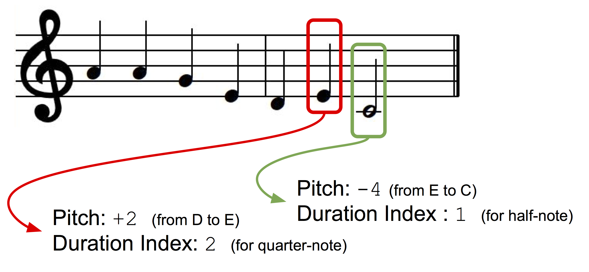
	<figcaption>Data Representation</figcaption>
</figure>

_Model Architecture:_

For this task, we use a model architecture similar to one used by Colombo et al. [5](http://arxiv.org/abs/1606.07251){:target="_blank"}, in which they simultaneously train 2 LSTM based networks for one genre of music: a) a Pitch network that learns how to predict the next Pitch given the previous note and previous duration, b) a duration network that learns how to predict the next duration given the next note and previous duration.  Additionally, we add embedding layers before the LSTM networks for mapping the input pitch and duration indices into learnable embedding spaces.  The network architecture is shown in the Figure below. 

<figure>
	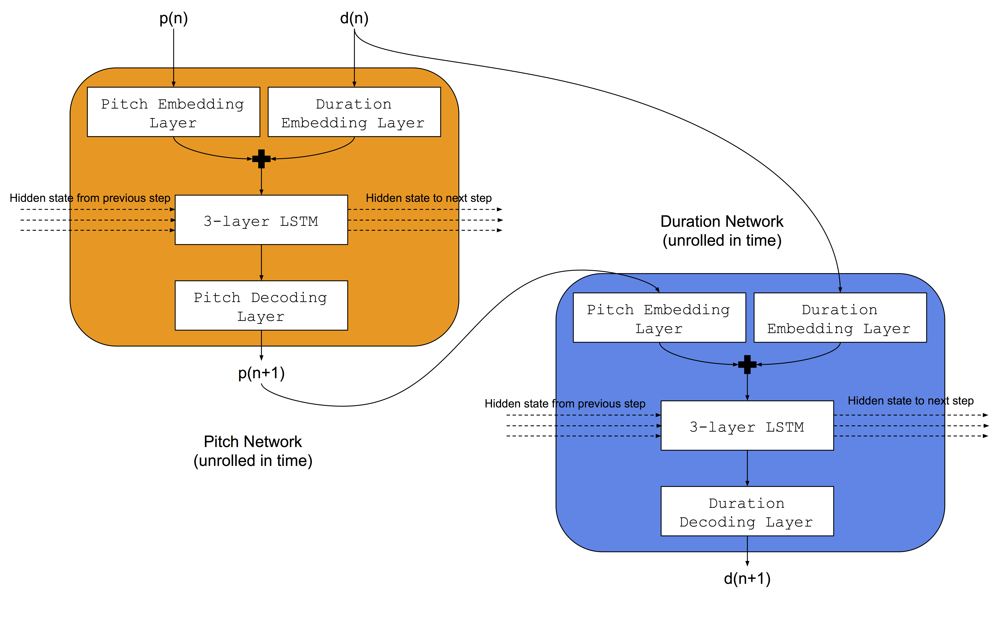
	<figcaption>Model Architecture</figcaption>
</figure>

_Training Procedure:_

For each genre of music, both the pitch and duration networks are trained simultaneously.  We use two datasets: a) [Norbeck Folk Dataset](http://www.norbeck.nu/abc/){:target="_blank"} comprising of around 2000 Irish and Swedish folk melodies, b) A Jazz dataset (not available publicly) comprising of around 500 Jazz melodies. 

_Fusion of Trained Models:_

During test time, a melody is first generated using the pitch and duration networks trained on the first genre (say Folk). Then, the pitch sequence of the generated melody is used as an input to the duration network trained on the different genre (say Jazz) resulting in a new duration sequence. Thus, the melody created by combining these has a pitch sequence conforming to first genre (Folk) and a duration sequence conforming to the second genre (Jazz). 

## Preliminary Results
Short excerpts of a couple of sample outputs are shown below:

<table>
  <tr>
    <td style="text-align: center; vertical-align: middle;">Folk Pitch with Folk Duration:</td>
    <td style="text-align: center; vertical-align: middle;">
      <audio controls="">
      <source src="/assets/img/StyleTransferImages/generated_melody_ff.mp3" />
      </audio>
    </td>
  </tr>
</table>

<figure>
	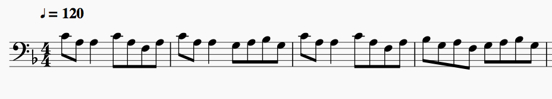
	<figcaption>Excerpt of score (Folk Pitch with Folk Duration)</figcaption>
</figure>

<table>
  <tr>
    <td style="text-align: center; vertical-align: middle;">Folk Pitch with Jazz Duration:</td>
     <td style="text-align: center; vertical-align: middle;"><audio controls="">
       <source src="/assets/img/StyleTransferImages/generated_melody_fj.mp3" />
       </audio>
     </td>
  </tr>
</table>

<figure>
	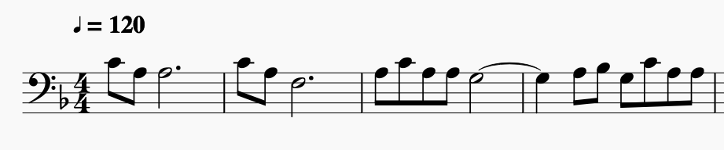
	<figcaption>Excerpt of score (Folk Pitch with Jazz Duration)</figcaption>
</figure>

<table>
  <tr>
    <td style="text-align: center; vertical-align: middle;">Jazz Pitch with Jazz Duration:</td>
    <td style="text-align: center; vertical-align: middle;">
      <audio controls="">
      <source src="/assets/img/StyleTransferImages/generated_melody_jj.mp3" />
      </audio>
    </td>
  </tr>
</table>

<figure>
	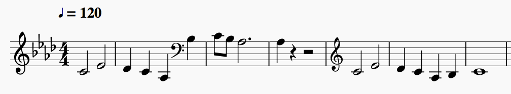
	<figcaption>Excerpt of score (Jazz Pitch with Jazz Duration)</figcaption>
</figure>

<table>
  <tr>
    <td style="text-align: center; vertical-align: middle;">Jazz Pitch with Folk Duration:</td>
     <td style="text-align: center; vertical-align: middle;"><audio controls="">
       <source src="/assets/img/StyleTransferImages/generated_melody_jf.mp3" />
       </audio>
     </td>
  </tr>
</table>

<figure>
	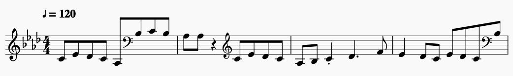
	<figcaption>Excerpt of score (Jazz Pitch with Folk Duration)</figcaption>
</figure>

## Conclusion
Even though the current algorithm is a good place to start, it has a few critical shortcomings:
1.	There is **no way to "transfer style" based on a specific target melody**. The models learn pitch and duration patterns from a genre and hence all transformations are generalized to a genre. It would be ideal to be able to morph a given piece of music to the style of a specific target song/piece. 
2.	There is **no way to control the degree** to which the style is to be modified. It might be very interesting to have a "knob" which can control this aspect. 
3.	There is **no way to preserve musical structure** in the transformed melody when genres are fused. Long-term structure is essential to music appreciation in general and for the generated melodies to be musically aesthetic, musical structure needs to be maintained. 

We will explore ways to overcome these shortcomings in subsequent works. 

