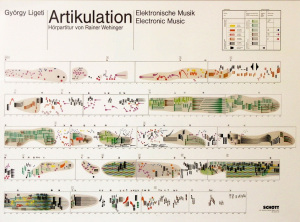

## Introduction

Interactive music does not have a universally accepted definition. One could argue that any musical instrument is interactive because it responds to some sort of input and the sound produced by the instrument influences the listener thereby creating a feedback loop. However, this is a very broad definition and it isn’t very interesting because under the scope of this definition everything musical is interactive. Rowe [2] defined interactive computer music systems as:

Interactive computer music systems are those whose behavior changes in response to musical input. Such responsiveness allows these systems to participate in live performances, of both notated and improvised music.

Rowe’s definition focuses on using only audio input however I think a system can be an interactive music system even if its primary input is through some other medium, in this case I am focusing on image. The reason Rowe stresses the importance of audio input is because that is how humans interact musically, by listening to each other. However, I think humans interact musically with visuals as well. Landscapes, art, lighting etc. inspire musical creativity so an instrument which combines the process of generating images and music is an interesting kind of interactive system where the image can influence the music and the music can influence the image. 

<figure>
	
	<figcaption>Left: Content Image, Middle: Style Image, Right: Content + Style, image source: <a href="https://blogthehum.wordpress.com/2016/04/05/gyorgy-ligetis-artikulation-with-score-and-audio/" target="_blank">Link</a></figcaption>
</figure>

## CONCEPT

This project focuses on exploring the space of simultaneous image and music generation. The idea is that there are some parameters for the image which alter the sound and there are some parameters for the sound that alter the image. 
  
I intend this system to be used by people with no musical background. It is of foremost importance that the instrument is fun and that a person should be willing to interact with it even if they don’t fully understand how the mappings work.

## CONTEXT

This project was inspired by the score for Ligeti’s Artikulation as designed by Wehinger as shown in the figure. The score was developed after the music but what I found captivating about the score was that even though it didn’t use traditional music notation I felt that it helped me understand the music better. 

My project tries to have a system where the music affects the image and the image affects the music. It also tries to have a visual representation that is not conventional yet sounds appropriate to the music.

## IMPLEMENTATION
The entire system was built in MAX. The algorithm is split into two parts: procedural drawing and sound generation. The two parts are interdependent so after the two parts are introduced separately the relation between the image and audio will be explained.

Procedural drawing is the idea of automatically generating an image by mapping the digital pen to some function. In this case two lines are drawn in every iteration of the draw function. To draw two lines we need three points. The first point is the pen’s current location, the next two points are given by four sinewaves. We need four sinewaves because each point has an x-component and a y-component.

The sound generation has four steps. The source is a click which is passed through a resonance filter. Then, the output of the resonance filter is passed through a delay and finally distortion is added by changing the sample rate and the word size of the audio.

In this project the speed at which each line is drawn is affected by the amplitude of the signal. The mouse function is used to perturb the image being drawn and by perturbing the image the delay time, delay gain and resample rate are affected. 

## DISCUSSION
The inputs to the system were primarily numerical inputs that have to be manually typed into the terminal, there were a few inputs that were mapped to the mouse location. The good part about the input is that you get rewarded from the image for finding interesting number patterns, for example integer multiples tend to produce more symmetric and pleasing images. The drawback of the input is that there are too many inputs and while there is an attempt at many to many mapping I don’t think it is as efficient as it could be.

The output of the system is very good, I think there is a wide sound space and image space to be explored. I think the system would have benefitted from more feedback loops where the various outputs tweaked the inputs and created an auto image and sound generating system given a starting state.

I touched upon the mappings before. I think the mouse mapping is fun to play around with because the sound and image changes when it is clicked at different parts of the LCD. The weakness is that there isn’t enough many to many mappings as stated before, I think more many to many mappings would make the system simpler to use while retaining the complexity of the output.

The system is fairly transparent, I think a user can clearly see that the image and sound are dependent on each other. It is slightly unclear as to how they depend on each other though.	

## FUTURE WORK
 
The main idea that I am interested in working on is to create a modular system where image parameters feed into any sound parameter and vice versa. The goal would be to allow for maximum flexibility in terms of both image and sound design. This would help increase the ceiling of the instrument and also maintain the low floor. I envision a system where changing the system feeds into itself and changes on its own without any external perturbations and the goal of the musician would be to find this interesting starting states and enjoy the audiovisual changes as the system tries to stabilize.

The second idea would be introducing the idea of collaborative drawing and sound design. Currently the system is designed for one person. I think it would be very interesting if two people drew on the same canvas by changing parameters for the same pen. 	

